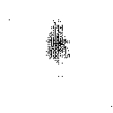

# Image Segmentation with U-Net

## Overview
This project implements the U-Net architecture for image segmentation using TensorFlow. U-Net is a convolutional neural network (CNN) architecture designed for biomedical image segmentation tasks, but it has been widely adopted for various image segmentation applications due to its effectiveness and efficiency.

## Features
- Implementation of the U-Net architecture for semantic segmentation.
- Support for various image formats, including JPG, JPEG, and PNG.
- Pretrained models for quick deployment.
- User-friendly interface using Streamlit.

## Installation
1. Clone the repository:
```git clone https://github.com/DevanshL/Image-Segmentation.git```
cd Image-Segmentation

2. Install the required dependencies:

```pip install -r requirements.txt```

3. Download the pretrained model weights and place them in the `models` directory.

## Usage
1. Run the Streamlit app:
2. Upload an image using the file uploader in the sidebar.
3. View the segmented image generated by the U-Net model.


## Examples
Here are some example images segmented using the U-Net model:

- Example 1:


- Example 2:


## Contributing
Contributions are welcome! Please fork the repository and submit a pull request with your changes.


